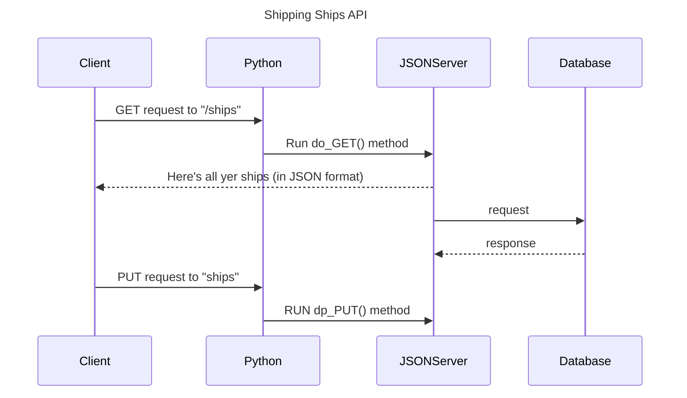

```mermaid
sequenceDiagram
    title Shipping Ships API

    participant Client
    participant Python
    participant JSONServer
    participant Database
    Client->>Python:GET request to "/ships"
    Python->>JSONServer:Run do_GET() method
    JSONServer-->>Client: Here's all yer ships (in JSON format)
    JSONServer->>Database: request
    Database-->>JSONServer: response
    Client->>Python:PUT request to "ships"
    Python->>JSONServer:RUN dp_PUT() method
```
